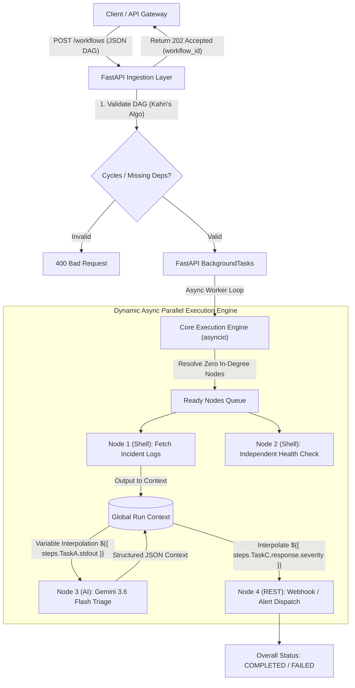

# Workflow Execution Engine — Live Demo & Presentation Script
**Nutanix Hackathon — Problem Statement 4**  
**Team:** Sathiyan Anand Sinha & Pranav Shalya

---

## 1. Executive Pitch (The "Why") — *[30 Seconds]*

> *"Modern cloud and hybrid infrastructure is inherently distributed, asynchronous, and unpredictable. Traditional automation relies on fragile linear bash scripts or monolithic cron jobs that break on the first error, block event loops, and lack real-time decision-making.*
>
> *We built the **Next-Gen Workflow Execution Engine**: a lightweight, highly extensible, asynchronous orchestrator that ingests complex DAGs defined in JSON. It features **true parallel concurrency**, **non-blocking background execution**, **granular failure isolation**, **dynamic context variable passing**, and an **integrated AI Reasoning Node powered by Gemini 3.6 Flash** to triage and remediate infrastructure incidents in real time."*

---

## 2. Architecture & Core Capabilities (What We Built)



### Core Innovations & Technical Highlights
1. **Asynchronous Parallel DAG Scheduling (`engine.py`):**
   - Implements **Kahn’s Algorithm** (`topological_sort`) for upfront DAG cycle and dependency validation.
   - Evaluates dependency resolution dynamically: nodes whose dependencies reach `SUCCESS` execute in parallel via `asyncio.create_task` and non-blocking worker threads (`asyncio.to_thread` for subprocesses, `httpx.AsyncClient` for REST and AI).
2. **Non-Blocking Background Ingestion (`main.py`):**
   - `POST /workflows` validates the graph upfront and immediately returns `202 Accepted` with a UUID `workflow_id`.
   - Execution runs asynchronously in FastAPI's `BackgroundTasks`, enabling live polling via `GET /workflows/{workflow_id}`.
3. **Granular Lifecycle States & Failure Isolation:**
   - Explicit state transitions: `PENDING` $\to$ `RUNNING` $\to$ `SUCCESS` | `FAILED` | `SKIPPED`.
   - If a step fails, the engine cascades `SKIPPED` only to its downstream dependency subgraph (`_mark_descendants_skipped`). **Independent parallel branches continue running to full completion.**
4. **Dynamic Variable Substitution & Context Data Passing:**
   - Global runtime `context = {"steps": {}}` captures stdout, stderr, exit codes, and JSON responses.
   - Expression interpolation `${{ steps.STEP_ID.property }}` and deep dot/bracket indexing (e.g. `${{ steps.ai.response.recommended_action }}`) dynamically reconstruct configs before step execution.
5. **Native AI Reasoning Node (`type: "ai"`):**
   - Integrated with **Gemini 3.6 Flash API** for real-time anomaly triage, classification, and decision routing.
   - Enforces structured JSON output (`response_format: "json"`) with automatic fence-stripping and error handling.
6. **JQ JSON Transformation Node (`type: "jq"`):**
   - Filters, maps, and reshapes structured payloads dynamically between pipeline stages using standard JQ query expressions.
7. **Conditional Routing Node (`type: "condition"`):**
   - Evaluates pythonic boolean expressions and structured comparisons (`left`, `operator`, `right`) safely via AST analysis without `eval()`.
   - On `False`, selectively deactivates downstream subgraphs (`SKIPPED`) with transparent reasoning while independent parallel branches continue and the workflow succeeds as `COMPLETED`.

---

## 3. The Live Demo Scenario (Step-by-Step Walkthrough)

### Narrative: Automated IT Incident Triage & Remediation
*An infrastructure incident occurs (e.g. worker node memory exhaustion). The workflow engine triggers a multi-stage pipeline:*
1. **FetchLog (Shell):** Fetches the latest system crash error log.
2. **IndepBranch (Shell):** Concurrently runs an independent cluster health check in parallel.
3. **AiTriage (AI Node):** Ingests the raw log, analyzes root cause, and generates structured JSON diagnostics using Gemini 3.6 Flash.
4. **NotifySlack (REST):** Reads the AI output dynamically (`${{ steps.AiTriage.response.severity }}`) and dispatches an alert payload to a webhook.

---

### Step 1: Start the Workflow Engine API

In your terminal:
```bash
uvicorn main:app --reload --port 8000
```
*Expected: FastAPI launches with `WindowsProactorEventLoopPolicy` and OpenAPI UI at `http://127.0.0.1:8000/docs`.*

---

### Step 2: Ingest the Incident Response Workflow

Submit the JSON DAG payload:

```bash
curl -X POST http://127.0.0.1:8000/workflows \
  -H "Content-Type: application/json" \
  -d '{
    "steps": [
      {
        "id": "FetchLog",
        "type": "shell",
        "config": {
          "command": "echo Out of memory error in worker pool 3 on host worker-09"
        }
      },
      {
        "id": "AiTriage",
        "type": "ai",
        "config": {
          "prompt": "Analyze this incident log: ${{ steps.FetchLog.stdout }}. Return JSON with keys: severity, root_cause, and recommended_action.",
          "response_format": "json"
        },
        "depends_on": ["FetchLog"]
      },
      {
        "id": "NotifySlack",
        "type": "rest",
        "config": {
          "url": "https://httpbin.org/post",
          "method": "POST",
          "body": {
            "alert_level": "${{ steps.AiTriage.response.severity }}",
            "incident_cause": "${{ steps.AiTriage.response.root_cause }}",
            "action_required": "${{ steps.AiTriage.response.recommended_action }}"
          }
        },
        "depends_on": ["AiTriage"]
      },
      {
        "id": "IndepBranch",
        "type": "shell",
        "config": {
          "command": "echo Health check: Database and Storage clusters are HEALTHY"
        }
      }
    ]
  }'
```

#### What the Judges See (Instant Response):
```json
{
  "workflow_id": "9b1deb4d-3b7d-4bad-9bdd-2b0d7b3d001a",
  "status": "PENDING",
  "message": "Workflow accepted for background execution"
}
```
*Talking point: Notice the `HTTP 202 Accepted` response within single-digit milliseconds. The client is never blocked.*

---

### Step 3: Poll Workflow Execution & Inspect Context

Query the workflow status using the returned ID:

```bash
curl -X GET http://127.0.0.1:8000/workflows/<WORKFLOW_ID>
```

#### What the Judges See (Completed Output):
```json
{
  "workflow_id": "9b1deb4d-3b7d-4bad-9bdd-2b0d7b3d001a",
  "status": "COMPLETED",
  "success": true,
  "results": {
    "FetchLog": {
      "id": "FetchLog",
      "type": "shell",
      "status": "SUCCESS",
      "success": true,
      "stdout": "Out of memory error in worker pool 3 on host worker-09",
      "stderr": "",
      "exit_code": 0
    },
    "IndepBranch": {
      "id": "IndepBranch",
      "type": "shell",
      "status": "SUCCESS",
      "success": true,
      "stdout": "Health check: Database and Storage clusters are HEALTHY",
      "stderr": "",
      "exit_code": 0
    },
    "AiTriage": {
      "id": "AiTriage",
      "type": "ai",
      "status": "SUCCESS",
      "success": true,
      "response": {
        "severity": "HIGH",
        "root_cause": "OOM (Out Of Memory) event on worker pool 3",
        "recommended_action": "Restart worker pool 3 and increase memory allocation limit"
      }
    },
    "NotifySlack": {
      "id": "NotifySlack",
      "type": "rest",
      "status": "SUCCESS",
      "success": true,
      "status_code": 200,
      "response": {
        "json": {
          "alert_level": "HIGH",
          "incident_cause": "OOM (Out Of Memory) event on worker pool 3",
          "action_required": "Restart worker pool 3 and increase memory allocation limit"
        }
      }
    }
  },
  "context": {
    "steps": { ... }
  }
}
```

---

## 4. Key Talking Points for the Judges

| Evaluation Dimension | How We Win |
| :--- | :--- |
| **1. Innovation** | **Agentic Intelligence in the Graph:** We didn't just build a dumb task-runner. With the native **Gemini 3.6 Flash AI Node**, workflows can parse unstructured text, make autonomous reasoning decisions, and pass structured JSON decisions directly into downstream HTTP/Shell remediation nodes. |
| **2. Completeness & Robustness** | **True Asynchronous Architecture:** Full non-blocking pipeline from API ingress (`HTTP 202` background worker) to runtime graph execution (`asyncio.create_task` concurrency, `asyncio.to_thread` subprocess isolation). Cycle detection via Kahn's algorithm guarantees graph integrity. |
| **3. Granular Fault Tolerance** | **Surgical Failure Containment:** When a node fails, only its downstream dependent subgraph transitions to `SKIPPED`. Parallel independent branches remain unaffected and execute to full `SUCCESS`. |
| **4. Extensibility & Design** | **Zero-Core-Modification Plugins:** Adding database connectors, Slack alerts, or Kubernetes operators requires simply declaring `@register_step_type("custom")` without modifying any engine internals. |
