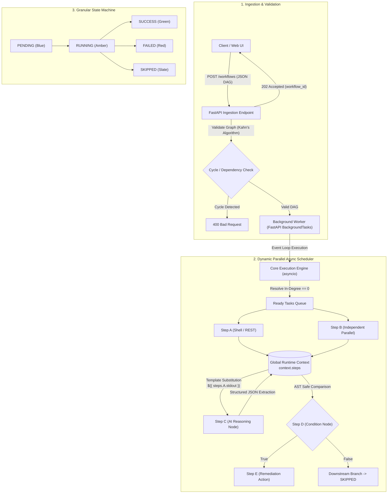

# Enterprise-Grade Agentic Workflow Orchestrator
**Nutanix Hackathon — Problem Statement 4: Workflow Execution Engine**  
**Authors:** Sathiyan Anand Sinha & Pranav Shalya

[](https://www.python.org/downloads/)
[](https://fastapi.tiangolo.com)
[](https://opensource.org/licenses/MIT)

An enterprise-grade, asynchronous, parallel Directed Acyclic Graph (DAG) execution engine designed for autonomous Day-2 IT infrastructure operations and intelligent incident remediation.

Built with Python's asynchronous core (`asyncio`), this engine ingests multi-step workflow graphs via JSON, validates graph topology upfront using Kahn's algorithm, executes independent branches in parallel, manages inter-step context passing, supports dynamic AI-driven reasoning, and provides a real-time visual web dashboard.

---

## Architecture & System Design



### Core Architecture Highlights

1. **True Asynchronous Parallel Scheduling (`engine.py`):**
   - Implements **Kahn’s Algorithm** for deterministic cycle detection and in-degree validation before execution starts.
   - Dynamically schedules all ready tasks (`in_degree == 0` and all dependencies reached `SUCCESS`) concurrently using `asyncio.create_task` and `asyncio.wait(return_when=FIRST_COMPLETED)`.
   - Subprocess executions are offloaded to worker threads via `asyncio.to_thread(subprocess.run)` to guarantee non-blocking event-loop operation across Windows and Linux.

2. **Granular State Machine & Failure Isolation:**
   - Explicit lifecycle states: `PENDING` $\to$ `RUNNING` $\to$ `SUCCESS` | `FAILED` | `SKIPPED`.
   - If a step fails, the engine cascades `SKIPPED` recursively only to its downstream dependency subgraph (`_mark_descendants_skipped`). **Independent parallel branches continue running to completion without interruption.**

3. **Safe AST Conditional Branching (`type: "condition"`):**
   - Safe condition evaluation powered by Python's built-in Abstract Syntax Tree (`ast`) parser. Arbitrary code execution (`eval()`) is strictly prohibited.
   - Evaluates boolean expressions (e.g. `'${{ steps.ai.response.decision }}' == 'APPROVE' and ${{ steps.ai.response.score }} >= 90`) and structured operand comparisons (`left`, `operator`, `right`).
   - Automatically handles type coercion across strings, numbers, and booleans (e.g. comparing `"200"` with `200` or `"true"` with `True`).
   - On `condition_met: False`, selectively deactivates downstream branches while preserving overall workflow `COMPLETED` status.

4. **Dynamic Context Passing & Nested Templating:**
   - Runtime context accumulates live step outputs into `context["steps"][step_id]`.
   - Supports deep dot/bracket property resolution: `${{ steps.StepA.stdout }}`, `${{ steps.RestStep.response.args.token }}`, `${{ steps.AiStep.response.recommendations[0].action }}`.

---

## Node Ecosystem

The engine features an extensible decorator-based registry (`@register_step_type("name")`):

| Node Type | Handler | Purpose | Configuration Keys |
| :--- | :--- | :--- | :--- |
| **`shell`** | `handle_shell` | Asynchronous command execution with stdout/stderr capture and timeout protection. | `command` (or `cmd`), `timeout` |
| **`rest`** | `handle_rest` | Non-blocking HTTP requests via `httpx.AsyncClient` with JSON body and header support. | `url`, `method`, `body`, `headers`, `timeout` |
| **`ai`** | `handle_ai` | LLM-powered incident triage and dynamic decision making via Google Gemini 3.6 Flash. | `prompt`, `response_format: "json"`, `model`, `timeout` |
| **`jq`** | `handle_jq` | In-memory JSON filtering, reshaping, and aggregation using standard JQ syntax. | `query`, `data` |
| **`condition`**| `handle_condition`| Safe AST boolean evaluation for selective branch activation and deactivation. | `expression` or `left`, `operator`, `right` |

---

## Real-Time Visual Graph Dashboard

The orchestrator includes a built-in single-page web UI served directly by FastAPI at `http://127.0.0.1:8000/`:

- **Interactive Canvas (`vis-network`):** Visualizes the workflow DAG with hierarchical directed edges and real-time color transitions (Blue $\to$ Amber $\to$ Green/Red/Slate).
- **Pre-Loaded Presets:**
  1. *End-to-End AI Triage + Condition + Remediation*
  2. *JQ Cluster Metrics Filter & Auto-Scale*
  3. *Failure Propagation & Independent Branching*
- **Live Node Inspector:** Click any node during or after execution to inspect its live stdout, stderr, structured JSON response, configuration, and exact skip/failure reasons.
- **Global Context Viewer:** Live observation of inter-step runtime context variables (`${{ steps }}`).

---

## Quickstart & Setup

### Prerequisites
- Python 3.10 or higher
- Git

### 1. Clone & Setup Virtual Environment

```bash
# Clone the repository
git clone https://github.com/Sathiyan1712/workflow-execution-engine.git
cd workflow-execution-engine

# Create and activate virtual environment
python -m venv venv

# Windows:
venv\Scripts\activate

# Linux / macOS:
source venv/bin/activate
```

### 2. Install Dependencies

```bash
pip install -r requirements.txt
```

### 3. Configure Environment Variables

Create a `.env` file in the root directory:

```env
GEMINI_API_KEY=your_gemini_api_key_here
```

### 4. Start the Application

```bash
uvicorn main:app --reload --port 8000
```

- **Visual Dashboard:** [http://127.0.0.1:8000/](http://127.0.0.1:8000/)
- **Interactive OpenAPI Documentation:** [http://127.0.0.1:8000/docs](http://127.0.0.1:8000/docs)

---

## API Reference

### 1. Submit Workflow (Async Ingestion)
- **Method / Endpoint:** `POST /workflows`
- **Response Code:** `202 Accepted`
- **Request Body:**
```json
{
  "steps": [
    {
      "id": "FetchLog",
      "type": "shell",
      "config": {
        "command": "echo Out of memory error on worker-09"
      }
    },
    {
      "id": "AiTriage",
      "type": "ai",
      "config": {
        "prompt": "Analyze log: ${{ steps.FetchLog.stdout }}. Return JSON with 'severity' and 'requires_restart' (boolean).",
        "response_format": "json"
      },
      "depends_on": ["FetchLog"]
    },
    {
      "id": "CheckRestart",
      "type": "condition",
      "config": {
        "expression": "${{ steps.AiTriage.response.requires_restart }} == true"
      },
      "depends_on": ["AiTriage"]
    },
    {
      "id": "Remediation",
      "type": "shell",
      "config": {
        "command": "echo Restarting worker-09 pool"
      },
      "depends_on": ["CheckRestart"]
    }
  ]
}
```
- **Response:**
```json
{
  "workflow_id": "3fa85f64-5717-4562-b3fc-2c963f66afa6",
  "status": "PENDING",
  "message": "Workflow accepted for background execution"
}
```

### 2. Poll Workflow Execution State
- **Method / Endpoint:** `GET /workflows/{workflow_id}`
- **Response:**
```json
{
  "workflow_id": "3fa85f64-5717-4562-b3fc-2c963f66afa6",
  "status": "COMPLETED",
  "success": true,
  "results": {
    "FetchLog": {
      "id": "FetchLog",
      "type": "shell",
      "status": "SUCCESS",
      "stdout": "Out of memory error on worker-09",
      "exit_code": 0
    },
    "AiTriage": {
      "id": "AiTriage",
      "type": "ai",
      "status": "SUCCESS",
      "response": {
        "severity": "CRITICAL",
        "requires_restart": true
      }
    },
    "CheckRestart": {
      "id": "CheckRestart",
      "type": "condition",
      "status": "SUCCESS",
      "condition_met": true,
      "skip_downstream": false
    },
    "Remediation": {
      "id": "Remediation",
      "type": "shell",
      "status": "SUCCESS",
      "stdout": "Restarting worker-09 pool",
      "exit_code": 0
    }
  },
  "context": {
    "steps": { ... }
  }
}
```

### 3. List All Executions
- **Method / Endpoint:** `GET /workflows`

### 4. Interactive Web Dashboard
- **Method / Endpoint:** `GET /`

---

## Running the Automated Test Suite

The repository contains end-to-end unit, pipeline, and API integration tests:

```bash
# Run core engine tests (linear, parallel branching, context passing, AI, JQ, Condition nodes, error handling)
python test_engine.py

# Run FastAPI background execution & HTTP integration tests
python test_api.py
```

---

## Repository Structure

```
workflow-execution-engine/
├── engine.py           # Core async execution engine, DAG validator, scheduler & step handlers
├── main.py             # FastAPI service, BackgroundTasks ingestion, & dashboard endpoint
├── templates/
│   └── index.html      # Self-contained visual DAG dashboard (Tailwind CSS + vis-network)
├── test_engine.py      # 15 automated test suites for DAG scheduling & step execution
├── test_api.py         # HTTP test suite for FastAPI background execution
├── demo_request.json   # Sample incident remediation DAG payload
├── DEMO_SCRIPT.md      # 3-minute live presentation and demonstration guide
├── requirements.txt    # Production & development dependencies
└── README.md           # Project documentation and architecture guide
```

---

## Team & Hackathon Submission

**Nutanix Hackathon — Problem Statement 4**  
- **Sathiyan Anand Sinha**
- **Pranav Shalya**